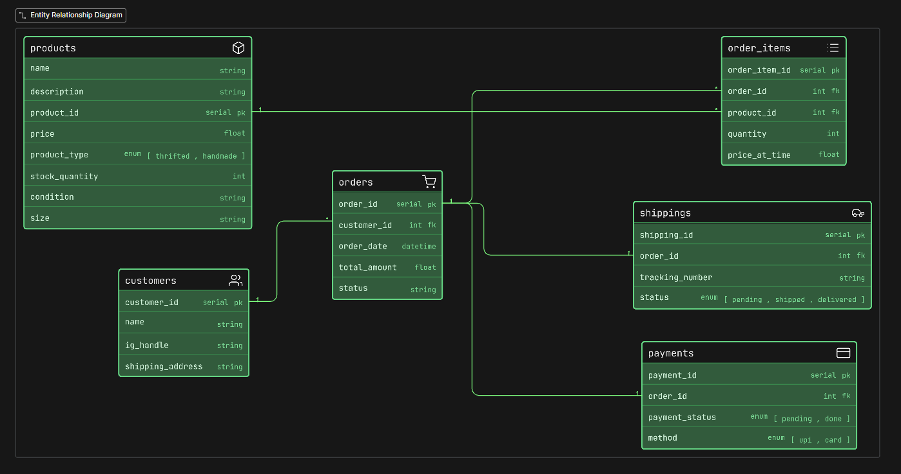

# Instagram Thrift Creator Store (DB Design)

## Problem Statement:

A small creator has started an Instagram-based store where they sell thrifted fashion items and handmade products. At first, the business is very small and receives orders through Instagram DMs and WhatsApp. Over time, the store starts growing and now the owner wants to manage products better, keep track of available stock, handle customer orders properly, and maintain basic information about delivery and payments.

Some products are thrifted and only have one piece available. Some are handmade and can have multiple units. Some items may have size, color or condition details. The business owner may also want to store customer details, order history, payment status and shipping status.

Your task is to design the ER diagram for the database of this business.

This is not just a “shop” problem. You should think carefully about how thrift and handmade products may differ. For example, a thrift item may be unique, while a handmade item may be created in batches or in multiple pieces. A good design should reflect the business properly.

### Thought Process:

- Find the main things(Tables)
- Find the things jo table me aa sakta hai 
- make relationships between tables

### Tables:

1. Product => listing the product details 
2. Customer => kisne order kiya 
3. Order => kya order kiya 
4. Order_Item => kya kya order kiya 
5. Payment => payment details
6. Shipping => delivery details

### ER Diagram:

### Relationships:

- 1 custmer can place many orders (1 to many)
- 1 order me many orders items (1 to many)
- 1 product in many order items (1 to many)
- 1 order has 1 payment (1 to 1)
- 1 order has 1 shipping (1 to 1)