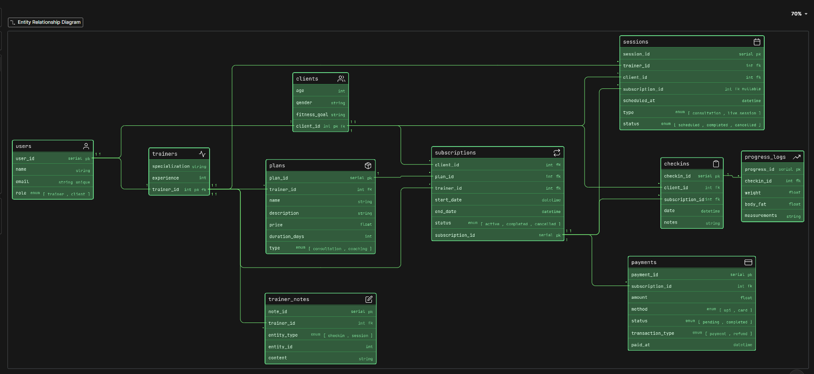

# Fitness Influencer Coaching Platform (DB Design)

## Problem Statement:

A fitness influencer has started an online coaching business. Initially, they train a few people through Insta DMs and Meet video calls. As their brand grows, they now want a platform where they can onboard clients, sell fitness plans, schedule consultations, manage subscriptions, track client progress and maintain regular check-ins.

Some users join only for consultation. Some buy long-term coaching plans. Some may attend live sessions, while others may only receive a training routine and diet guidance. The platform should also be able to track progress information such as weight, body measurements, check-in reports and trainer notes.

Your job is to design the ER diagram for this platform.

This is not a gym management problem. This is more of an online coaching ecosystem where one or more trainers/influencers manage multiple clients and provide structured online fitness support.

### Requirements:
- Onboard clients
- sell fitness plans
- schedule consultations or live sessions
- manage subscriptions
- track client progress
- maintain weekly check-ins
- provide trainer feedback
- handle payments

### Thought Process:

- Find the main things(Tables)
- Find the things jo table me aa sakta hai 
- make relationships between tables

### Tables:

- users
- trainers
- clients
- plans
- subscriptions
- sessions
- checkins
- progress_logs
- trainer_notes
- payments

### ER Diagram:

### Relationships:

- 1 user and 1 trainer
- 1 user and 1 client
basically users se hi nikle hai trainers and clients
- 1 trainer - many plans (1 to many)
- 1 client - many subscriptions (1 to many)
- 1 subscription - 1 plan (1 to 1)
- 1 subscription - many sessions (1 to many)
- 1 trainer - many sessions (1 to many)
- 1 client - many checkins (1 to many)
- 1 subscription - many checkins (1 to many)
- 1 checkin - many progress_logs (1 to many)
- 1 trainer - many trainer_notes (1 to many)
- 1 subscription - many payments (1 to many)