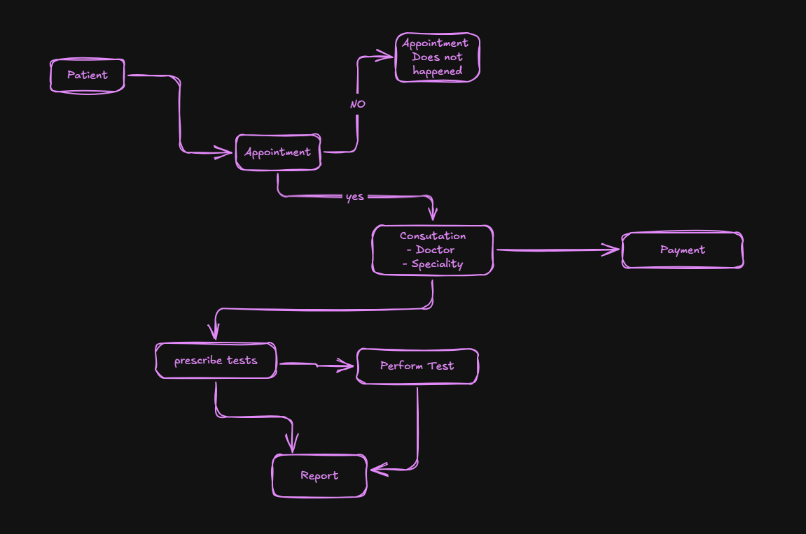
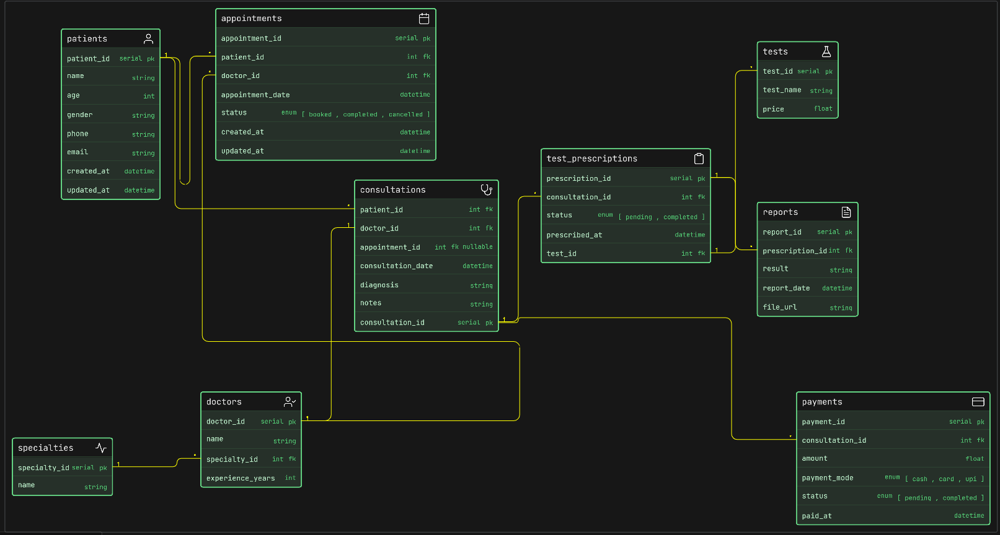

# Clinic Appointment and Diagnostics Platform (DB Design)

## Problem Statement:

A modern clinic wants to organize its operations digitally. They want to manage doctors, patients, appointments, consultations, diagnostic tests, reports, and payments. Patients should be able to visit doctors, book appointments, undergo tests if prescribed, and receive reports later.

The clinic may have multiple doctors across different departments or specialties. A patient may visit the clinic multiple times. During a visit, the doctor may prescribe one or more diagnostic tests. The diagnostic reports may be generated later and linked back to the patient and doctor visit.

Your task is to design the ER diagram for this clinic system.

This assignment is not about making a hospital-level giant system. Keep it focused on a clinic that handles appointments, consultations, diagnostics, and reporting in a clean and scalable way.

### Thought Process:
- Understand the flow of the clinic operations
- Find the main things(Tables)
- Find the things jo table me aa sakta hai 
- make relationships between tables

### Flow 

### ER Diagram:

### Relationships:
- 1 patient - many appointments (1:M)
- 1 patient - many consultations (1:M)
- 1 doctor - many appointments (1:M)
- 1 doctor - many consultations (1:M)
- 1 specialty - many doctors (1:M)
- 1 appointment - 1 consultation (1:1)
- 1 test - many test prescriptions (1:M)
- 1 test prescription - 1 reports (1:1)

