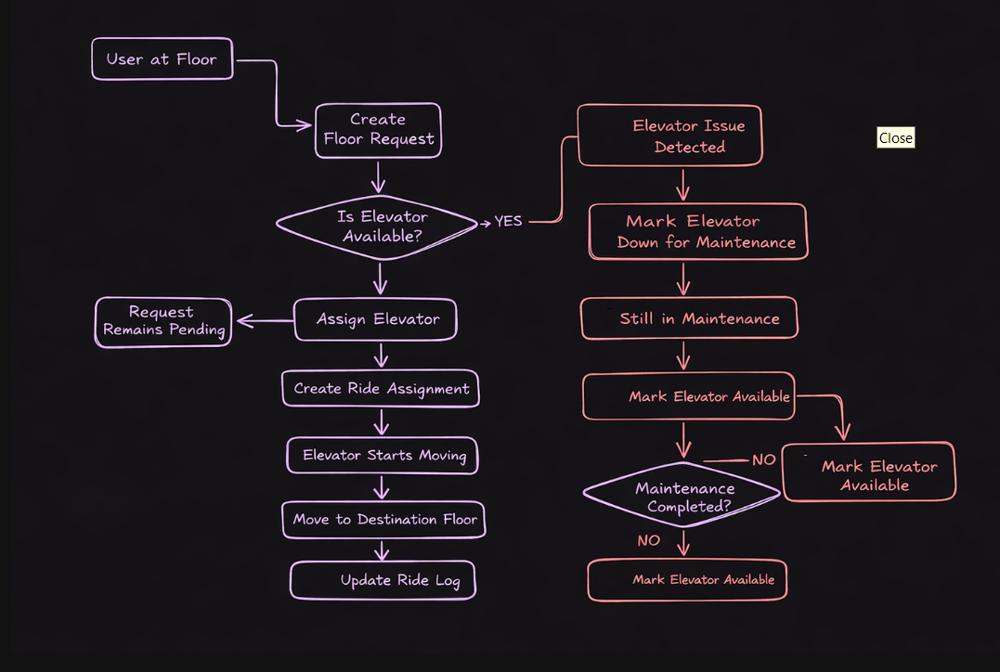
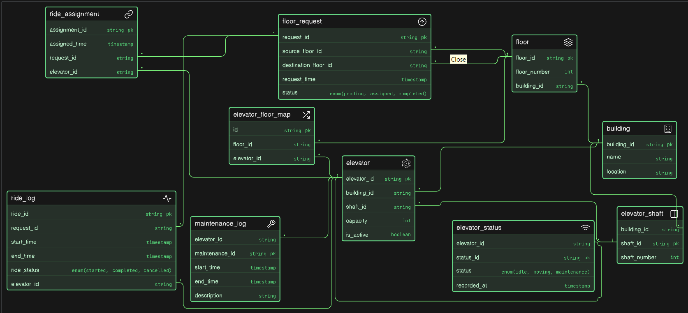

# Smart Elevator Control (DB Design)

## Problem Statement:

A fast-growing infrastructure technology company called LiftGrid Systems builds intelligent elevator control platforms for large commercial buildings across India.

Their software is used in corporate towers, malls, airports, hospitals and high-rise residential complexes where dozens of elevators operate together across many floors.

Unlike small standalone lifts, these buildings run multiple elevators per building, grouped into zones, handling thousands of passengers daily. The system must manage elevator assignments, floor requests, maintenance tracking and ride logs efficiently.

Each building can contain multiple elevator shafts. Each shaft contains one elevator. Each elevator moves across a defined set of floors and responds to ride requests generated by users from different floors.

The system should support:

- multiple buildings
- multiple elevators inside each building
- floor-level request tracking
- ride allocation to elevators
- elevator status monitoring
- maintenance tracking
- usage history logging

This backend platform helps operations teams monitor performance and ensures elevators remain safe, efficient and available.

Your task is to design the ER diagram for this smart elevator control system.

This is a multi-building infrastructure management system handling real-time movement requests, elevator allocation and operational tracking.

### Thought Process:
- Understand the flow of the parking operations
- Find the main things(Tables)
- Find the things jo table me aa sakta hai 
- make relationships between tables

### Flow 

### ER Diagram:

### Relationships:

