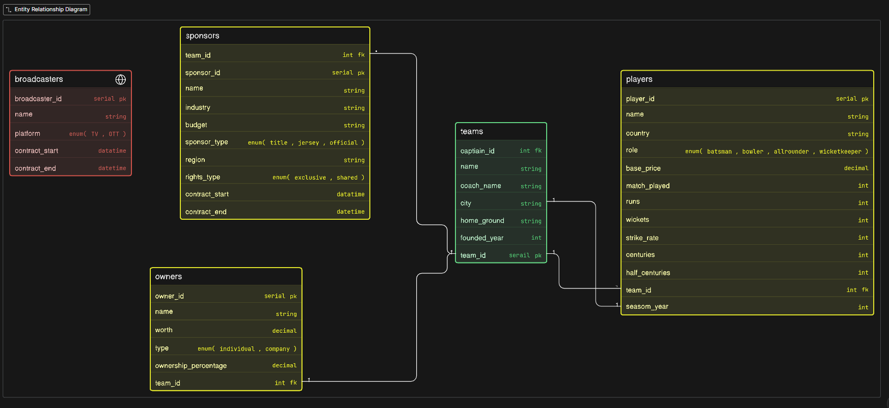

# IPL management (DB Design)

## Problem Statement:

A simple IPL management system that have only these fields 
- Team
- Player 
- Owner 
- Sponsor 
- Broadcasts

### Thought Process:
- Find the main things(Tables)
- Find the things jo table me aa sakta hai 
- make relationships between tables

### ER Diagram:

### Relationships:
- 1 owner - 1 team (1:1)
- 1 team - many players (1:N)
- 1 team - many sponsors (1:N)
- 1 team - 1 capitain (1:1)

